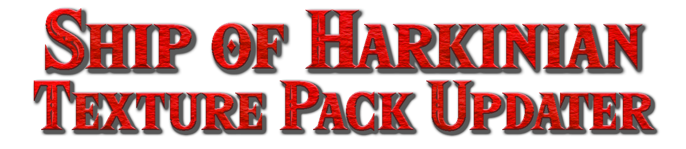

# Ship of Harkinian Texture Pack Updater

This tool simplifies the process of updating the Ship of Harkinian Texture Pack from versions 7.1.1 and beyond. These newer versions of the texture pack standardize texture names and folder structures, making it easier to work with different ROM versions without the need for specific patches (e.g., PAL 1.1 or Vanilla GC).

## Website

Official Website: https://www.shipofharkinian.com/

## Discord

Official Discord: https://discord.com/invite/shipofharkinia

## Prerequisites

1. Before using this tool, make sure you can run PowerShell scripts on your computer. If you're not already set up for PowerShell, you can find resources online to help you get started.

2. [**retro - OTR generator**](https://github.com/HarbourMasters64/retro)

## Getting Started

1. **Backup Your Original Texture Folder:** As a precaution, create a backup of your original texture folder. This ensures that your original files are safe.

2. **Run the Script:** Execute the provided PowerShell script and provide the path to the folder you want to convert. This script will rename the textures and organize them according to the new standard.

3. **Copy from Retro:** After running the script, you will have your textures renamed and organized. Copy these updated textures to a freshly extracted OTRs from Retro.

4. **Important Note:** Make sure not to include the `manifest.json` file when copying the updated textures. This file is specific to the Retro and should not be included in your updated texture pack.

With this tool, updating your Ship of Harkinian Texture Pack to the latest versions is a breeze, and you can enjoy a smoother and more consistent experience across different ROM versions.
Happy texturing!

